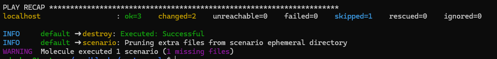
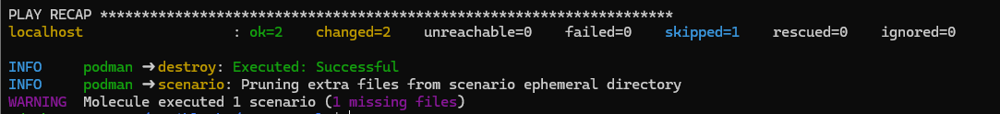
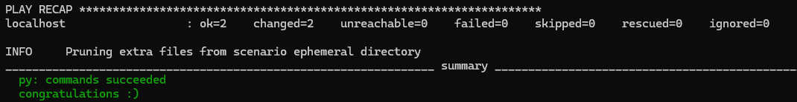

#Вывод после выполнения molecule test -s default


#Вывод после выполнения molecule test -s podman


#Вывод после выполнения tox


# vector-role

Ansible-роль для установки и настройки [Vector](https://vector.dev).

## Требования
- Ansible ≥ 2.10
- Поддерживаемые ОС: Debian 11/12, RHEL/Alma/Rocky 8/9

## Переменные

| Переменная | По умолчанию | Описание |
|---|---|---|
| `vector_version` | `"0.39.0"` | Версия Vector |
| `vector_pkg_type` | `"deb"` | Тип пакета: `deb` или `rpm` |
| `vector_service_name` | `"vector"` | Имя сервиса |
| `vector_config_path` | `"/etc/vector/vector.toml"` | Путь к конфигу |
| `vector_download_deb` | см. defaults | URL .deb |
| `vector_download_rpm` | см. defaults | URL .rpm |
| `vector_sources` | syslog-источник | Источники (dict) |
| `vector_sinks` | file-sink | Приёмники (dict) |

### Пример инвентаря
```ini
[vector]
vec1 ansible_host=10.0.0.20
>>>>>>> 5ef6464 (molecule docker, podman, tox)
